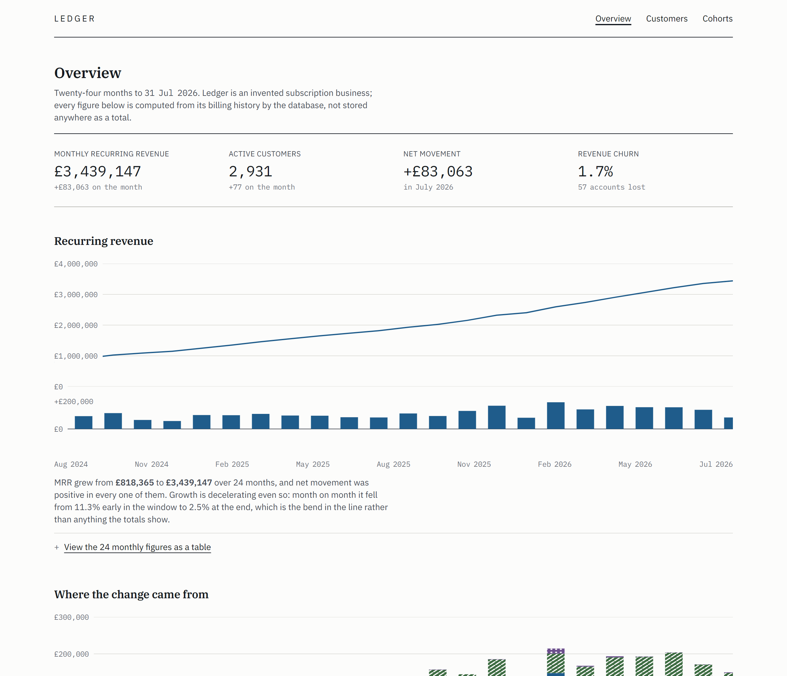
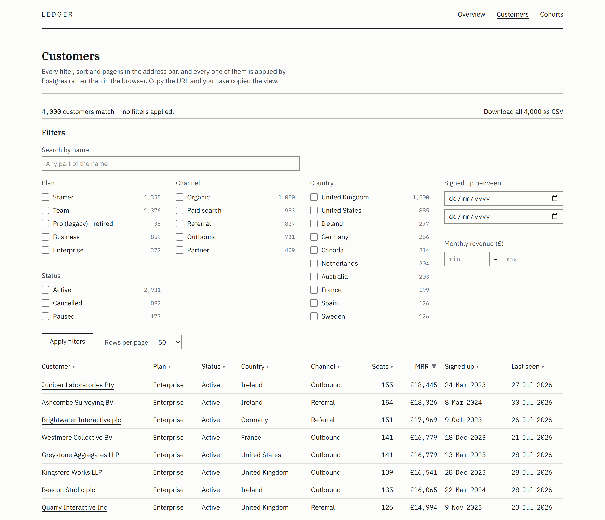
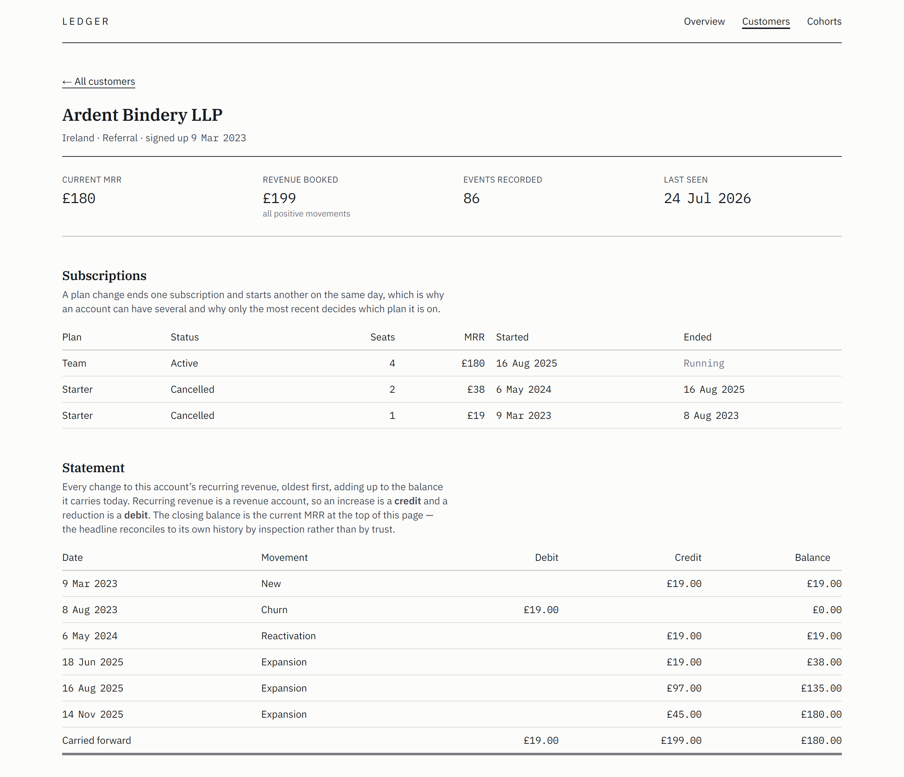
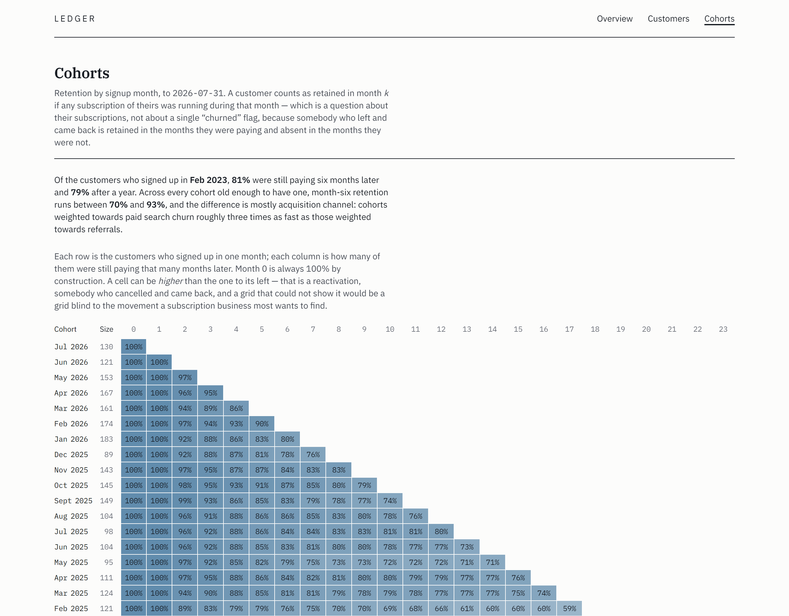
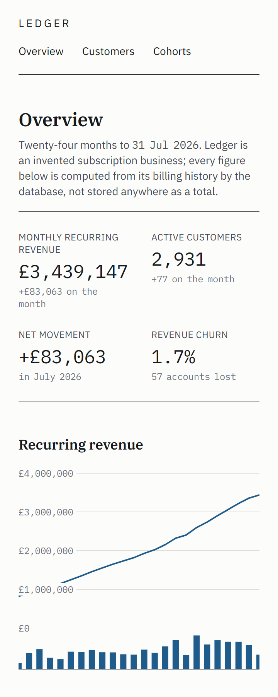

# Ledger

A subscription billing analytics dashboard for an invented SaaS. Four thousand
customers, two complete years of billing history, a quarter of a million product
events — and the point of it is that a data-dense interface stays fast and stays
usable at that volume. Every dashboard query is under 100 ms at p95 against the
deployed database, Lighthouse is 98+ on all five categories with CLS at 0, and axe
finds nothing across seven pages.

**Live:** https://ledger-beta-wheat.vercel.app

Ledger is not a real company and none of the four thousand customers exist. It is
one of my own demo builds, not client work, and nothing on the site is a photograph
or a generated image.

Next.js 16 (App Router) · TypeScript · Postgres on Neon · Drizzle with migrations
checked in · Tailwind v4 · Vitest · **no charting library** and **no client-side
JavaScript holding any state**.



> **Listened to with NVDA on 24 August**, not only checked mechanically. It found five
> defects that seven clean pages of axe had not, including a table caption the page
> rendered correctly and the screen reader read as "sorted by Mrrdescending. Showing50
> of 4,000", and a result count that had been marked `aria-live` for weeks and had
> never once been announced. All five are fixed and the transcripts are checked in.
> [What it found, and what changed](#the-screen-reader-pass).

---

## Lighthouse

Lighthouse 13.4.1 with its default mobile emulation, run against the deployed URL rather
than a local build. Median of five runs per page, re-measured after the screen-reader
pass changed the markup.

| | Performance | Accessibility | Best practices | SEO | Agentic Browsing |
|---|---|---|---|---|---|
| `/` — the overview | **99** | **100** | **100** | **100** | **100** |
| `/customers` — 4,000 rows, filtered | **99** | **100** | **100** | **100** | **100** |
| `/cohorts` — the retention grid | **98** | **100** | **100** | **100** | **100** |

**CLS is 0 on all three**, which is the number a layout change is most likely to cost
you and the one I check first. It is also the number three self-hosted webfonts are most
likely to cost you, and it is zero because `next/font` generates a metric-matched
fallback — the type does not move when the real face arrives.

TTFB is 13–14 ms and TBT is 17–34 ms. LCP is 2.0–2.2 s, and essentially all of that is
render delay under Lighthouse's simulated mobile throttling rather than the server:
every one of these pages is rendered per request against Postgres in London, and the
document arrives in about fifteen milliseconds.

Five runs rather than three because performance is the category that will not sit still.
The overview scored 100, 99, 99, 99, 99 across those five. Quoting the 100 would have
been the easier thing to do and it would have been a screenshot rather than a
measurement.

`/customers` was 97 before the screen-reader pass and is 99 after it. That is not a
performance optimisation: replacing `next/link` with plain anchors was done because a
client-side navigation announces nothing to a screen reader, and dropping the client
router took total blocking time down with it. Worth recording because it usually runs
the other way, and "accessible" gets argued about as though it costs something.

**These were taken warm.** Neon's free tier suspends compute after five minutes idle, so
a genuinely cold first request pays several hundred milliseconds before Postgres answers
anything. That is a property of the tier rather than of the queries, and a number
measured cold would be measuring the tier.

Agentic Browsing is the fifth category in Lighthouse 13, replacing PWA. It scores what
an agent rather than a person can make of the page: the accessibility tree it would have
to navigate, layout stability, and whether the site publishes an
[llms.txt](https://ledger-beta-wheat.vercel.app/llms.txt). Ledger's is generated
from the same rollup the overview reads, so it cannot drift into confidently stating last
month's numbers — and its first paragraph says the company is invented, so an agent
researching real subscription-analytics tools on somebody's behalf can tell in one
sentence and stop.

---

## Query performance

Every demo in this portfolio has one hard thing. Ledger's is that it stays fast
with real data, so this is the section worth reading.

### The dataset

`npm run seed` builds it in about fourteen seconds:

| | |
|---|---:|
| Customers | 4,000 |
| Subscriptions | 4,531 |
| MRR movements | 8,985 |
| Product events | 258,751 |
| Days of daily rollup | 1,275 |

Two complete years of report window (August 2024 to July 2026) on top of eighteen
months of prior history, so the MRR line starts from a going concern rather than
from the origin.

The generator is a pure function and nothing on the seed path reads
`Math.random()`, `Date.now()` or the system clock — one mulberry32 stream, one fixed
seed, and even the UUIDs come out of it. That is not tidiness. Every timing below is
a claim about one specific dataset, and a test asserts thresholds against the same
rows; if `npm run seed` produced a different dataset each time, a failing performance
test would be indistinguishable from an unlucky one.

It is also not uniform, because uniform data hides the bugs that matter. Acquisition
grows at a rate that decays from about 5.5% a month to a little over 1%, so the MRR
line bends instead of accelerating away. Signups are seasonal — B2B software sells in
September and January and does not sell in August or late December. The channel mix
shifts from word of mouth towards paid search and outbound as the invented company
grows, and paid search churns roughly three times as fast as a referral, which is why
the cohort grid has a shape to read. Churn hazard decays with tenure and bumps on each
annual renewal, because that is when somebody looks at the invoice. A retired
`legacy-pro` plan is closed to new business after the thirteenth month and still has
customers on it two years later.

### The method

`npm run measure -- <label>` writes `docs/measurements/<label>.md`. Nothing in this
section is typed by hand.

One connection, so every run sees the same backend and the same buffer cache. A
warm-up run that is discarded, then a set of timed runs reported as median and p95;
the sample size adapts to how slow the query turned out to be and **the table prints
what it was**, because a run count that quietly differed between the before and the
after would be a way to cheat the comparison. `explain (analyze, buffers)` is captured
separately from the timing, because `explain analyze` carries its own instrumentation
overhead and its "Execution Time" is not what a user waits for.

The before-and-after pair below is local Postgres 17 in Docker with 256MB of shared
buffers and 768MB of `effective_cache_size` — deliberately a small server. The third
table is the deployment's own database.

### Reading the tables

Two time columns, and against a remote database the gap between them is the point.

**Server** is planning plus execution inside Postgres, out of `explain (analyze)`.
It carries that statement's own per-node instrumentation overhead, so it is an upper
bound on the database's cost rather than the cost itself — which is why a few rows
below show a server figure slightly *above* the wall clock beside it.

**Median / p95** is wall clock from the machine running the harness: the database, plus
the round trip to it, plus the driver. It is what a caller actually waited.

### Before: no indexes beyond the primary keys

The first migration deliberately creates nothing but primary keys and two slug uniques.
An unindexed schema can only be measured before the indexes exist. Local Postgres, so
the network term is nil.

| Query | Server | Median | p95 | Scans |
|---|---:|---:|---:|---|
| `mrr-series (from movements)` | 1.25 s | 999.5 ms | 1.05 s | Seq Scan on subscription, Seq Scan on mrr_movement |
| `mrr-series (from rollup)` | 2.9 ms | 4.4 ms | 5.2 ms | Seq Scan on daily_rollup, Seq Scan on mrr_movement |
| `mrr-series (correlated subquery)` | 648.0 ms | 442.3 ms | 458.2 ms | Seq Scan on mrr_movement |
| `cohort-retention` | 71.8 ms | 64.1 ms | 70.2 ms | Seq Scan on customer, Seq Scan on subscription |
| `customer-table (page 1, unfiltered)` | 516.2 ms | 546.2 ms | 570.6 ms | **Seq Scan on event**, + 3 others |
| `customer-table (page 12, four filters)` | 541.0 ms | 568.5 ms | 579.8 ms | **Seq Scan on event**, + 3 others |
| `customer-table (sorted by last seen)` | 36.60 s | **33.72 s** | — | **Seq Scan on event**, + 3 others |
| `customer-events` | 30.5 ms | 31.0 ms | 38.2 ms | **Seq Scan on event** |

### After: five indexes

| Query | Server | Median | p95 | Change |
|---|---:|---:|---:|---:|
| `customer-table (sorted by last seen)` | 83.1 ms | 63.5 ms | 74.9 ms | **531×** |
| `customer-table (page 12, four filters)` | 20.5 ms | 13.9 ms | 18.9 ms | **41×** |
| `customer-table (page 1, unfiltered)` | 18.9 ms | 17.4 ms | 20.8 ms | **31×** |
| `customer-events` | 0.3 ms | 1.8 ms | 3.1 ms | **17×** |
| `mrr-series (correlated subquery)` | 484.3 ms | 280.0 ms | 333.4 ms | 1.6× |
| `cohort-retention` | 69.2 ms | 63.8 ms | 73.0 ms | — |
| `mrr-series (from rollup)` | 2.6 ms | 4.6 ms | 6.0 ms | — |
| `mrr-series (from movements)` | 1.25 s | 990.7 ms | 1.01 s | — |

The last four rows are the honest part of this table: three of them did not improve.

`cohort-retention` and the two series queries are not index-bound. The cohort grid's
cost is a cross join of every cohort against every month offset — CPU over a few
thousand rows, and no index changes it. Where the before and after differ by a few
milliseconds on those rows, that is run-to-run variance on a laptop, and it is left in
the table rather than quietly re-run until it looked tidier.

`mrr-series (correlated subquery)` is the shape you get from writing the obvious
subquery: for each of 730 days, re-sum every movement up to that day. An index takes it
from 442 ms to 280 ms, which is the least interesting improvement here, because the
problem with it is not the scan — it is quadratic in the life of the business. The
window-function version is `mrr-series (from movements)`, and it does the same
arithmetic over the money in single-digit milliseconds. Nothing renders from the
correlated version; it is kept as a measured baseline so this section can put a number
on a claim instead of asserting it.

### And on the deployment: Neon, London

Everything above is a laptop. This is the database the live site actually reads —
Neon on AWS `eu-west-2`, free tier, with the Vercel functions pinned to `lhr1` in
`vercel.json` so both halves are in the same city.

| Query | Server | Median | p95 |
|---|---:|---:|---:|
| `mrr-series (from rollup)` | 3.5 ms | 34.3 ms | 37.9 ms |
| `cohort-retention` | 83.2 ms | 94.3 ms | 100.6 ms |
| `customer-table (page 1, unfiltered)` | 19.5 ms | 44.0 ms | 48.1 ms |
| `customer-table (page 12, four filters)` | 16.3 ms | 40.2 ms | 42.2 ms |
| `customer-table (sorted by last seen)` | 80.3 ms | 83.6 ms | 87.3 ms |
| `customer-events` | 0.6 ms | 28.6 ms | 30.8 ms |

The two columns come apart here, and `customer-events` is the clearest case: 0.6 ms
inside Postgres, 28.6 ms measured from my desk. Twenty-eight of those milliseconds are
the round trip from a domestic connection to London and back. The deployed function
does not pay them — it is in the same region as the database — which is the entire
reason `vercel.json` pins the region. A function in Washington reading this database
would add roughly eighty milliseconds to every row in that table, and the 100 ms p95
target would be gone before Postgres had done any work.

Neon's free tier suspends compute after five minutes idle, so the first request after a
quiet period pays a cold start of several hundred milliseconds. That is a property of
the tier, not of the queries, and any Lighthouse number quoted here will say whether it
was measured warm.

### The one that mattered: `event (customer_id, occurred_at desc)`

A customer page shows the last fifty things that happened to one account. Before:

```
Limit  (actual time=23.788..30.352 rows=50 loops=1)
  Buffers: shared hit=3419
  ->  Gather Merge  (Workers Launched: 2)
        ->  Sort  (Sort Key: occurred_at DESC, id)
              ->  Parallel Seq Scan on event e  (actual time=0.006..4.180 rows=103 loops=3)
                    Filter: (customer_id = '090dd5f5-…'::uuid)
                    Rows Removed by Filter: 86148
Execution Time: 30.402 ms
```

Three workers between them read every one of 258,751 rows and threw away 258,443 of
them. After:

```
Limit  (actual time=0.231..0.236 rows=50 loops=1)
  Buffers: shared hit=300
  ->  Sort  (Sort Key: occurred_at DESC, id)
        ->  Bitmap Heap Scan on event e  (actual time=0.052..0.177 rows=308 loops=1)
              ->  Bitmap Index Scan on event_customer_occurred_idx  (actual time=0.034..0.034)
                    Index Cond: (customer_id = '090dd5f5-…'::uuid)
                    Buffers: shared hit=5
Execution Time: 0.295 ms
```

3,419 buffers to 300, of which the index itself is five. 30.4 ms to 0.3 ms. The descending second column is
not decoration: the query is `order by occurred_at desc limit 50`, and a matching
index order is the difference between reading fifty rows and reading every row for
that account and sorting them.

There is deliberately **no** index on `customer.country` or
`customer.acquisition_channel`, both of which are filters on the customer table. They
are low-cardinality columns on a four-thousand-row table, where a sequential scan
genuinely is the cheaper plan and the planner will pick it whatever the schema
declares. An index the planner ignores still costs a write on every insert; it is not
free just because it is unused.

### Filter and paginate first, decorate afterwards

This is the shape that produced the 699× row, and it is a design decision rather than
an index.

A page of the customer table is fifty rows, and each row carries a last-seen timestamp
and an event count out of the quarter-of-a-million-row `event` table. The obvious query
joins that aggregate in alongside everything else and lets `limit 50` throw away 98.75%
of the work at the very end. It reads well and it is correct.

Here the filtering, sorting and pagination happen first, against `customer`,
`subscription` and a small aggregate over the movement spine, and the lateral join that
touches `event` runs afterwards — fifty times, against an index, instead of once against
the whole table.

The exception is sorting by last seen, which cannot happen after the rows are chosen
because it is what chooses them. That one sort pays for a full aggregate over `event`;
every other sort does not. It is measured separately in both tables above for exactly
that reason, and at 47 ms it is still the slowest thing a page here does.

### What `daily_rollup` is actually for

The rollup is a cache over the movement spine. It is never the source of any number, it
can be dropped at any time, and `refreshRollup()` rebuilds it from scratch in one
statement.

At this volume it does **not** earn its place on the money. Nine thousand movements is
nothing, and the window-function version of the MRR series computes the running total in
about six milliseconds. If that were all the overview needed, the honest answer would be
to delete the table.

It earns its place on the active-customer count. A customer is active on a day if any of
their subscriptions spans it, so computing that honestly means checking every
subscription against every day in the window and counting distinct customers:
999 ms against 4.4 ms, which is 227× and is the whole gap between the two series
queries in the tables above. That is what the column is for.

Both implementations are kept and a test asserts they return identical rows across all
730 days — not spot-checked at the ends. A cache whose agreement with its source is
never checked is a cache that will be wrong one day, silently, in a way a customer
notices first.

The table is maintained on write by two triggers, because its columns have two
different sources. Money and the new/churn counts come from `mrr_movement`; a movement
on day D changes the running total on D and every day after it, which in a live system
is one row and when backfilling a year is expensive in proportion to how much of the
past was changed. `active_customers` cannot be derived from a movement at all — a
paused account that stops paying is a different fact from an account that has gone — so
a second trigger recounts it across the days a subscription spans. That one is a
recount rather than a delta because a customer can hold two subscriptions at once (a
plan change ends one and starts another on the same day), and
`count(distinct customer_id)` cannot be maintained by adding and subtracting ones.

The seed disables both triggers for the bulk load and rebuilds afterwards, which is
what a loader does.

### The test that guards it

Performance that isn't tested is performance that regresses. `performance.test.ts`
asserts two different kinds of thing, because each catches what the other cannot.

**A plan assertion.** Every dashboard query is run through `explain (analyze)` and
checked for a sequential scan of `event`. That is the regression that actually happens:
somebody drops an index, or adds a column that turns an index-only scan into a heap
fetch, or writes a filter the index cannot serve. A plan assertion is a claim about the
*shape* of the work, so it means the same thing on a laptop, on a build server and on
the free tier of Neon. It is the assertion that matters.

**A wall-clock ceiling**, at roughly five times the measured p95, and deliberately
loose. The point is not to pin a millisecond figure to hardware nobody else has; it is
to fail when a query goes from tens of milliseconds to tens of seconds, which is what
every regression here has actually looked like. The unindexed customer table took 32
seconds and its ceiling is 400 ms. Nothing in between is ambiguous.

Against the spec's target of every dashboard query under 100 ms at p95, on this machine:

```
  ✓     4.8 ms  overview: MRR series from the rollup
  ✓    66.2 ms  cohorts: retention grid
  ✓    19.6 ms  customers: page 1, unfiltered
  ✓    17.9 ms  customers: page 12, four filters
  ✓    50.2 ms  customers: sorted by last seen
  ✓     1.8 ms  customer: event feed
```

The cohort grid is the one with the least headroom, and it is CPU rather than IO. On
Neon it is 83 ms inside Postgres against a 100 ms budget, which is close enough that
it is the next thing to fix rather than a thing that is fixed. The answer when it comes
will not be another index: it will be to stop expanding every cohort against every
month offset in SQL and compute the grid from a single pass over subscription
intervals.

---

## When the database is asleep

This deployment runs on Neon's free tier, which suspends compute after five minutes
idle. That is the normal state for a link in somebody's inbox, so it is a state the build
has to be designed for rather than one it can treat as an exception.

**Two of the four routes had no fallback at all**, and they were the two most worth
linking to. `/` and `/cohorts` each caught their own query failures and rendered a written
explanation; `/customers` and `/customers/[slug]` had no try block, so a request landing on
a suspended compute rendered the framework's own *"Application error: a server-side
exception has occurred"*. All four share one `Unavailable` component now, each keeping its
own heading — a reader who followed a link to Customers should still be looking at a page
called Customers, because losing the address as well as the data turns a slow database
into a wrong one. Verified by stopping Postgres and requesting all four.

The retry is a plain link back to the same URL. There is no client-side JavaScript here to
re-run a fetch with and there does not need to be: a link to the current address is what a
retry is, it survives JavaScript being switched off, and it is honest about being a reload.

### Waiting is a designed state

Every navigation in this build is a real document load, so the browser holds the previous
page on screen until the new one starts rendering. That beats a blank screen and it is
still not feedback — on a cold compute the old page sits there looking frozen with nothing
but a tab spinner to say otherwise.

Next streams, so the fix costs no JavaScript. The root layout and a `loading.tsx` fallback
are flushed as soon as the request arrives; the page replaces them when the query returns.
Measured against a deliberately delayed query:

```
TTFB   0.011 s     <- masthead, heading and ruled page
total  3.042 s     <- the figures
```

The fallback is ruled paper: hairlines where the rows will be, in the same `--color-rule`
the tables use, at the same row height. No shimmer, no grey blocks. A printed report before
the figures are set is not a grey rectangle, it is a ruled page, and the build already owns
that vocabulary.

CLS stays at 0 across all three pages. That is measured warm, where the query returns
before the fallback ever paints — a genuinely cold start paints the rules first and then
swaps, which is a layout change by definition. It is the right trade: the alternative is
several seconds of a page that looks broken.

### The one client component

`app/error.tsx` is the only `'use client'` file in the build, and it is one because React
error boundaries are client components by construction — there is no server equivalent. It
holds no state and reads nothing from the browser; its entire client-side behaviour is a
reset button, and it costs **1,058 bytes**. Next renders it on the server for an error
thrown during SSR, so with JavaScript off the message and the link still work and only the
button is inert, which is why there is a link as well as a button. It shows the error's
`digest` — the server-side hash that is the only thing connecting what the reader saw to
what the logs recorded.

This is the backstop, not the mechanism: the four routes catch their own database failures
themselves, and this is for the rest.

One thing it does not do is set a status code. An outage page returns 200, because a Next
page component cannot set the response status. It is named here rather than papered over.

---

## Why there is no chart library

Recharts is the default reach. It brings its own look, its own DOM, and accessibility
behaviour you do not control.

The charts here are a line with movement bars beneath it, a stacked bar series, and a
cohort grid. All three are straightforward in SVG, all three are lighter than the
library that would draw them, and — the part that decided it — all three need keyboard
and screen-reader behaviour that has to be designed rather than inherited. Every chart
sits in a `<figure>` with a `<figcaption>` that states the finding in words, carries
`role="img"` and an `aria-label` summarising the shape with its internals
`aria-hidden`, and offers a "view as table" toggle to the underlying numbers in a real
`<table>`. That last one is not a fallback. It is a first-class view, and it is the
path somebody using a screen reader will take.

None of that is hard to add to a chart library. All of it is hard to add *correctly* to
a chart library, because the DOM it produces is not yours.

---

## Accessible charts

Three charts, and the picture is only one of four things each of them is.

**A `<figcaption>` that states the finding in words.** Not "MRR over time" — that
is a title, and a title tells you what you are looking at rather than what it says.
"MRR grew from £818,365 to £3,439,147 over 24 months, and month-on-month growth fell
from 11.3% to 2.5%" is the finding, and it is the sentence somebody would repeat in a
meeting. Everybody gets it: the person skimming, the person listening, the person who
prints the page. Those captions are **computed from the data they describe** rather
than typed, because a specific caption written once quietly stops being true.

**`role="img"` with an `aria-label` summarising the shape**, and the SVG internals
`aria-hidden`. Two hundred `<rect>` elements announced one at a time are worse than
silence.

**The numbers in a real `<table>`**, behind a native `<details>`. This is not a
fallback. It is a first-class view, it is what a screen reader user will navigate,
and it is the only way to read an exact value off any chart. A disclosure element is
keyboard-operable, announces its own expanded state, is findable by find-in-page, and
needs no JavaScript; a button with `useState` behind it would be more code doing less.

**Greyscale, by construction.** The movement chart stacks five series, and five hues
fails for one reader in twelve, fails again in print, and fails a third time on a
projector. Hue is the last of four encodings here and the only one carrying nothing
on its own: position separates gains from losses above and below a shared zero, length
is the amount, SVG patterns separate the series — solid, diagonal, dotted, horizontal
— and the legend carries the same patterns as the bars, so matching a swatch to a
series never depends on telling two colours apart. Print the page in black and white
and all of it survives.

The cohort grid is a table outright, with shading on top. A grid is rows, columns and
one number per cell; expressing it as table markup gets real headers, real navigation,
find-in-page and text selection for free. Every cell is double-encoded — the
percentage is printed *and* the background is shaded — because a lightness ramp
survives greyscale but cannot be read more precisely than "darker than that one".

### Contrast, measured

`npm run contrast` prints all thirteen pairings the interface uses and exits non-zero
if any falls below its threshold. It found a real failure on its first run, and the
fix was a distinction rather than a darker grey.

WCAG 1.4.11 asks 3:1 of *user interface components* and of *graphical objects required
to understand the content* — not of a hairline between two table rows. Holding a
decorative rule to 3:1 gives a page ruled in mid-grey, which is worse and no more
accessible. So the lines are split by job: `rule` and `rule-2` separate things and are
decorative, `field` outlines inputs and buttons at 3.33:1, and the zero baseline on the
movement chart — which somebody genuinely needs in order to read it — is drawn in ink.

The cohort ramp stops at 70% strength rather than 100%, and that number was measured
rather than chosen. At full strength the cell colour against the ink is 2.5:1 and
fails. The usual fix is to flip the text to white past a threshold, but the band around
75–85% fails *both* ways — 4.0:1 against ink and 4.47:1 against white — so no threshold
exists. Capping the ramp keeps every cell at 4.88:1 or better and costs only the top of
a range nobody reads a value off.

### The sweep

`npm run a11y` drives real Chrome over the DevTools protocol, tabs through seven pages
from the top the way a keyboard user would, and runs axe on each. **Zero axe violations
across all seven.** It also checks the things this build specifically claims: nine
tables with captions and scoped headers and no divs pretending to be rows, exactly one
`aria-sort` per page with the right value, the result count reached *before* the
filter panel that produced it, both chart SVGs hidden behind a labelled `role="img"`,
and the disclosures reachable by Tab and toggling on Enter.

It found three defects that reading the code had not.

**The skip link was not moving focus.** `<main>` is not focusable by default, so
`href="#main"` scrolled the page and left focus at the top of the document — the next
Tab went back to the second item in the header. It was broken on all seven pages and it
looked fine every time it was checked by hand, because the page does visibly jump.

**Targets were under the 24×24 that WCAG 2.2 asks for** — nav links, standalone links,
sort headings and the chart disclosures, all at the text's own height of 18 to 20
pixels.

**The third was the tool being wrong rather than the page.** It measured the focused
element's own box, so a checkbox inside its own `<label>` reported as 16px on a row
that is a 24px click target. 2.5.8 is about the area a pointer can hit, which for that
markup is the label. The sweep measures the label now, and says when it did.

### What the sweep was not checking

A later design critique went looking for what a clean sheet across seven pages was
worth, and the answer was: less than it read like. Four of the sweep's own checks were
broken, and each of them had been quietly passing.

**It only ever ran at 1280.** Every defect below exists only at a phone width.

**The sideways-scroll check could not fail.** It tested
`documentElement.scrollWidth > innerWidth`, and `globals.css` sets
`html { overflow-x: clip }` — which pins `scrollWidth` to `clientWidth` by definition.
It reported "no sideways scroll" on all seven pages for as long as it existed, while on
the overview the last three months of *both* chart axes were being drawn outside the
viewport with no way to reach them. `Feb 2026`, `May 2026` and `Jul 2026` were simply
invisible on a phone. The check now walks for content wider than the viewport with no
scrollable ancestor, which is the actual question.

**Six scrollable regions could not be reached by keyboard.** A `div` with
`overflow-x: auto` scrolls with a mouse and not with a keyboard, because Chrome only
gives arrow keys to a scroller that can take focus. Five of the six had nothing focusable
inside them; the sixth — the customer table — escaped by luck, because every row happens
to contain a link. axe has a rule for this and stayed silent, because the rule only fires
at a width where the region actually overflows. They share one `Scroller` component now,
and the sweep has its own probe, because axe still misses the two chart tables: they sit
inside a closed `<details>`.

**The tab walk stopped at stop 30 of 95.** It broke on the first repeated focus key,
which sounds like cycle detection and is not: `<input type="date">` has three internal
segments, and tabbing between them leaves `document.activeElement` on the same input.
So the walk halted at the signup-date field and had never once reached the customer
table — not one of the fifty row links, not a sort header, not the pager. It walks until
focus returns to the *first* stop now.

**And one correction the other way.** With the full tab order finally visible, fifty
customer-name links reported as 18px targets. They are not a failure: WCAG 2.5.8 exempts
an undersized target whose 24px circle does not reach another target's, and these are one
per table row, thirty-five pixels apart. Fifty standing false positives is how a real one
gets lost, so the check implements the spacing exception and reports the count that passes
on spacing separately rather than hiding it.

Each of these was verified by putting the defect back and watching the check go red. A
green check that has never been red is not evidence, which is the whole lesson of this
section.

---

## The screen-reader pass

`npm run nvda` starts NVDA against a scratch profile with the `silence` synthesiser, so
it logs every utterance without speaking any of it, drives Chrome through twenty
scenes with real keystrokes, and writes down what it said. Keys go through `SendKeys`
rather than the DevTools protocol on purpose: CDP-synthesised keys never reach the
keyboard hook, browse mode never engages, and a "screen reader test" driven that way is
a test of something else.

The sweep above and this are not the same thing. The sweep reads the accessibility
*tree*, which is what a screen reader consumes; NVDA is a separate program that layers
its own browse mode, its own table navigation and its own rules on top of it. Every one
of the five defects below sat in a tree that axe was perfectly happy with.

**Nine things were already right**, and it is worth saying which, because "we ran a
screen reader" is worth nothing without the transcript. The skip link is the first stop
and moves focus into `<main>`. Each chart figure announces its shape in a sentence —
*"Line chart of monthly recurring revenue across 24 months, rising steadily from
£818,365 to £3,439,147…"* — and its two hundred SVG elements are silent behind it. The
disclosures announce "button, collapsed", then "expanded", then a real table that walks
by row and column. The sorted column announces *"column 7, sorted descending, link,
MRR"*. The three tables on a customer page each announce their caption. The export says
*"Download all 1,085 as CSV"* before you press it. The empty state names the filter that
is excluding everything. The cohort grid reads as a table.

### The five it found

**A caption the page rendered correctly and the screen reader read wrong.** The customer
table's caption came out as *"Customers, sorted by Mrrdescending. Showing50 of 4,000."*
The DOM had the spaces. The screen looked right. But a text node containing nothing but
whitespace, standing between two elements, survives layout and is dropped when Chrome
computes the accessibility text — so a `{' '}` separator in JSX produces a sentence that
reads correctly and sounds broken.

**This is the finding worth keeping**, for two reasons. No automated tool catches it,
because every automated tool is reading the same DOM, and the DOM is fine. And reading
the page line by line does not catch it either — a visual line break supplies the space
that the accessibility text had dropped, so the defect hides wherever the sentence
happens to wrap. It only appears when a whole region is announced in one go, which is
what the `read-main-*` scenes do: they activate the skip link, and NVDA reads the newly
focused landmark end to end, joins and all.

Read that way it was in nine places, not one — the pagination line
(*"51–100 of4,000· page 2 of 80"*), the result count, both chart captions
(*"MRR grew from £818,365 to£3,439,147"*, *"expansion added £1,072,852 —33%"*), the
cohort finding, the customer header, the activity paragraph and the 404. Spaces now live
inside text nodes that have a word in them, and the pagination separator is a comma —
`sr-only` is `position: absolute`, and leading whitespace at the start of a box is
collapsed away before anything else gets a look at it.

**"Mrr".** The caption ran the sort column through a generic humaniser while the header
above it rendered a hand-written "MRR", so the two disagreed about the name of the same
column. There is now one list of columns and both read from it.

**"Starter1355".** Each plan filter carried its customer count inside the `<label>`, so
the count became part of the checkbox's accessible name and the number never said what
it counted. Sighted readers got the separation from the layout; nobody else did. The
figure is `aria-hidden` now and a described-by sentence carries it: *"Starter, check
box, not checked, 1,355 customers"*.

**A live region that had never once fired.** The result count was marked
`aria-live="polite"` on the theory that applying a filter would announce its result. It
cannot. Applying a filter submits a GET form, which loads a new document, and a live
region only announces a change to a region that is already on the page — NVDA reads the
new page from the top instead. So the attribute was doing nothing, the sweep was
checking that it was present rather than that it worked, and the claim in this README
was false.

The attribute has gone rather than been left in place looking helpful. What replaced it
is position: the count is now the first thing after the heading instead of sitting below
thirty checkboxes, so the reader meets it about seven lines into the page. The sweep
checks the ordering now, which is falsifiable in a way that "has the attribute" is not.

**Sorting was completely silent.** Pressing Enter on a column heading re-sorted four
thousand rows and NVDA said nothing at all — eight seconds of silence in the transcript,
with a control at the end of the scene proving the sort really had happened. `next/link`
navigates without tearing the document down, so there is no page-load announcement and
no live region to fire either. Every link in the build is a plain `<a>` now. There is no
client state on any of these pages to preserve, so the soft navigation was buying
nothing and costing that.

### Three more, from the design critique

**The nav never said which page you were on.** `aria-current` appeared zero times in the
served HTML, and there was no visual current state either, so this failed everybody. The
section nav is now the build's second client component — the pathname is not available to
a server layout, which was checked rather than assumed — but `usePathname` resolves during
server rendering, so `aria-current="page"` and the rule under the current label are both in
the HTML that arrives. NVDA reads it as *"Overview, same page, link, current page"*.

**The filter form was not a landmark.** A `<form>` only becomes one when it has an
accessible name, so a screen-reader user could not jump to the filters by rotor — they
walked down from the "Filters" heading every time, on a page whose entire purpose is
filtering.

**The title never changed when the results did.** `metadata.title` was the static
"Customers" for every filtered view, so the first thing announced after submitting a filter
was the same phrase as before pressing it. It reads `1,085 customers — Ledger` now.
`generateMetadata` and the page share one set of queries through React's `cache`, keyed on
the canonical query string — the cache key is the URL, which is what this page claims its
state is anyway — so the title costs no extra query. It costs no latency either: Next
streams metadata, and a deliberately delayed `generateMetadata` still returned first bytes
in 9.9 ms.

Every transcript is in [`docs/nvda/`](docs/nvda), one file per scene, verbatim. They are
the evidence for everything above, and they are checked in because a claim about a
screen reader that cannot be read back is not a claim, it is a reassurance.

---

## The URL is the state

Every filter, every sort and every page lives in the address bar, and one module
translates between a URL and a query. A filtered view pastes into Slack and opens as
the same view. The back button walks the filters somebody actually applied. The page
server-renders because everything it needs arrived with the request. And the CSV export
is the page's own query string with a different path, so the file and the screen cannot
disagree about what "the current view" is.

The filter panel is a plain `<form method="get">` whose fields are named exactly what
the parser reads, so the URL is identical whether it came from the form, from a pasted
link, or from the back button. Every sort, page and link is a plain `<a>` for the same
reason — and, after the screen-reader pass, for a second one: a client-side navigation
replaces the page without announcing anything at all, so somebody listening pressed a
column heading and heard silence. There is no client state to fall out of step with the
address bar, and the whole thing works with JavaScript switched off.

### Finding one customer among four thousand

There was no way to. The filters offered plan, status, channel, country, signup date and
revenue range, and no text input at all — so reaching a named account meant sorting by
name and paging through up to eighty pages, two clicks at a time. The 404 had been
sending people to a link labelled *"Search the customer table →"* since the day it was
written.

It is one more field in the same GET form, so it is one more parameter in the URL and it
needs no Apply: Enter in a text field submits the form it is in, which is the browser
doing for free what a search box usually needs JavaScript for. `perPage` came out with
it — it had been in the query options since the first commit, pinned to 50, a knob in the
URL that nobody could reach — and the pager gained First and Last, because two links were
the right answer for not printing eighty page numbers and the wrong answer for reaching
page eighty.

**It is `strpos`, not `ilike`, and a test is why.** The obvious form is
`c.name ilike '%' || $1 || '%'`, with the term bound rather than interpolated, and that is
safe from injection. It is not safe from *pattern syntax*: a bound parameter concatenated
into a LIKE pattern is still read as one, so searching for `%` matched all four thousand
customers. The test asserting that a wildcard is not a filter-that-matches-everything
caught it on its first run. `strpos` has no pattern language, so every character means
itself.

Measured rather than assumed: a sequential scan of four thousand customers matching 137
of them runs in **0.93 ms**. A `pg_trgm` GIN index would buy nothing at this size and
would have to be maintained on every write. The honest note is that this is the one
filter in the build that does not scale with the table — at four hundred thousand
customers it is the first thing that would need one.

### One predicate, not two

The table and the CSV export each had their own hand-written copy of the filter clauses.
They were byte-identical, which is the problem rather than the defence: this README claims
the file and the screen cannot disagree about what "the current view" is, and two copies of
a predicate is a promise that one day they will. Adding search made it concrete — the
export would have quietly ignored the search box.

They share `customerWhere` now, and a test walks five views (including a search, a search
combined with a country, and a search that matches nothing) asserting that the export
returns exactly the number of rows the page printed, in the same order.

### Going back to the view you came from

"← All customers" was a bare `/customers`. Filter four thousand rows down to a hundred and
seventeen, open one, press the page's own back link, and the filters were gone — the state
was in the URL the whole time and the interface threw it away.

Each row link carries the current query string, and the detail page reads it back through
the same parser the table uses and re-serialises it with the same writer. So whatever comes
out is a URL the customers page would have produced itself: a hand-edited `from` cannot
smuggle in a path or a host, and the worst it can do is describe an unfiltered table. The
page declares a canonical URL without it, because one page reachable at many addresses is
a page that should say which one is real.

Three rules hold in the parser, each with a test:

**Nothing throws.** These values come from a URL, which means they come from anybody.
An unrecognised sort column is the default sort, not a 500 and not a redirect. Twelve
hostile inputs are asserted — `DROP TABLE` as a sort column, a negative page,
`2025-13-45` as a date, a channel of `telepathy` — and the worst any of them can do is
show the first page of an unfiltered table.

**Defaults are absent rather than spelled out**, so `/customers` and
`/customers?page=1&sort=mrr&dir=desc` are the same URL and only one is worth putting in
front of somebody.

**Changing a filter returns to page one.** Landing on page twelve of three results is
the oldest bug in faceted search, and the fix lives in the one function every link is
built from rather than in each caller.

One correction worth recording, because it is the kind that hides: an out-of-range
money bound was being *discarded*, so asking for a minimum of ten million pounds showed
every customer while the URL still claimed a filter was applied — the count said one
filter and the address bar said two. It clamps now. An absurd bound is still a bound
somebody typed, and the empty state is the true answer to it.

### One thing I could not fix, and how far I got

Because the back button is a primary control here, these pages ought to be in the
browser's back/forward cache — and they are not. Lighthouse reports it, and the reason
is `cache-control: no-store`, which every dynamic route gets and which disqualifies a
page from bfcache outright. `no-cache` would keep the guarantee that matters — never
serve these without revalidating, because the numbers are live — and drop the one that
costs bfcache. There is no auth, no personalisation and no cookie on any of these
pages, so there is nothing here that must not be written to a disk cache.

Three attempts, each of which failed differently and each of which is worth knowing:

1. **A `headers()` entry in `next.config.ts`.** No effect. `headers()` adds headers to
   a response; the `no-store` on a dynamic route is applied by the framework when it
   renders, and it wins. The config read correctly and did nothing.
2. **Middleware rewriting the header on the way out.** This *works* — `npm run build &&
   npm start` locally serves `private, no-cache, must-revalidate`.
3. **The same middleware, deployed.** Vercel re-applies `no-store` at the edge for
   server-rendered functions, so the header the function returns is not the header the
   browser receives.

So it is a platform boundary rather than an application bug, and the middleware came
back out rather than shipping as code that works on my machine and is inert in
production. The alternative — making the pages static with a revalidate window — would
work, and would cost the claim that every number is computed per request, which is the
claim the whole performance section rests on. Between a faster back button and a
performance story that is true, the performance story wins.

---

## The statement

A design critique put it plainly: **the product is called Ledger and had never once drawn
one.** The customer page was three consecutive tables in identical treatment, and the
middle one — the money — was a `Change` column of signed amounts read newest-first. Every
ingredient of a ledger was already in the data and none of it was on the page.

It is a statement now. Facing debit and credit columns, oldest first, a running balance,
and the accountant's rules at the foot: a single line above the total meaning *these are
being added up*, and a double line beneath meaning *this figure is final*. CSS has had
`border-style: double` since the beginning and almost nothing uses it; at 3px it renders
as exactly what it is, two hairlines with a gap.

None of it is costume. The two columns separate what took revenue away from what added it
**without needing colour to do it**, which matters in a build where colour is reserved for
data marks and every chart has to survive greyscale. The empty cell in the column that did
not move is the ledger's own convention and reads better than printing `£0.00` twice on
every row. And the foot is a sum somebody can check by eye:

```
Carried forward        £19.00      £199.00      £180.00
                       debits      credits      closing
```

£199.00 − £19.00 = £180.00, which is the **Current MRR** printed at the top of the same
page. The headline reconciles to its own history by inspection rather than by trust —
which the previous version claimed in a sentence and this one demonstrates in a shape.

Debit and credit are the right way round for a revenue account, where an increase is a
credit. That is not common knowledge, so the standfirst says so rather than leaving the
reader to work out which column is which.

The ordering changed with it. A statement accumulates downward, so the movements come back
oldest-first; newest-first would run the balance in reverse and leave the figure that
matters at the top with nothing above it to have produced it. Ten movements is the most any
customer in the dataset has, so there was never a length argument for the other order.

A test walks the twenty-five busiest accounts and asserts three things: that the rows come
back in date order, that credits minus debits equals the closing balance, and that the
running balance from Postgres's window function agrees with accumulating the same rows by
hand in JavaScript.

---

## What is deliberately missing

**No authentication.** Every page is public. A real billing dashboard is the most
sensitive screen a company owns and would need sessions, roles, an audit trail of who
looked at what, and rate limiting. None of that is here, and none of it would have
demonstrated anything the query plans do not. It is worth being explicit that this is
an omission rather than an oversight: the data is invented precisely so that leaving
the door open costs nobody anything.

**No writes.** Nothing in the interface changes a row. The rollup triggers exist and are
tested against real inserts, so the write path is proven — but no screen exercises it.
A real product would need optimistic concurrency on the movement spine, and getting that
wrong on a revenue table is how a number quietly stops reconciling.

**No real-time.** The numbers are as at a fixed date, and the page says so. Streaming
updates into a dense table is a genuinely hard problem — what happens to your scroll
position, your sort, your selection — and solving it badly is worse than not solving it.

**No alerting, no multi-tenancy, no settings page, no dark mode.** Multi-tenancy is the
one I would build first, and it is not a feature: it is a row-level security policy on
every table and a tenant id in every index in this README, which changes all of the
performance work above rather than adding to it.

**Date filtering is a plain range picker**, not presets. "Last 90 days" against a report
with a fixed as-at date would be a lie with a friendly label on it.

**The cohort grid is CPU-bound and I would fix it next.** On Neon it is 83 ms inside
Postgres against a 100 ms budget — it passes, and it is the thinnest margin in the
build. The answer is not another index: it is to stop expanding every cohort against
every month offset in SQL and compute the grid from a single pass over subscription
intervals.

---

## Running it

```bash
npm install
cp .env.example .env          # DATABASE_URL
npm run db:up                 # Postgres 17 in Docker, on 5434
npm run db:migrate
npm run seed                  # deterministic, ~14s, 258,751 events
npm run dev                   # http://localhost:3003
```

```bash
npm test                      # 101 tests; most of them need the database
npm run measure -- before     # query timings and plans -> docs/measurements/
npm run contrast              # every contrast ratio, exits non-zero on a failure
npm run a11y                  # keyboard and accessibility-tree sweep, plus axe
npm run nvda                  # what NVDA actually says -> docs/nvda/*.txt
npm run shots                 # regenerates docs/*.png
```

The tests that need Postgres skip loudly rather than failing when there is no container
running, naming what went unproven — and `CI=1` turns the skip off entirely, because on
a build server an unreachable database is a broken pipeline rather than a local
convenience.

`a11y` and `shots` need Chrome installed and the server running; take the screenshots
against `npm run build && npm start` rather than the dev server, or the framework's
dev-tools badge sits in the corner of every one of them.

---

## Screenshots

| | |
|---|---|
|  |  |
|  |  |
